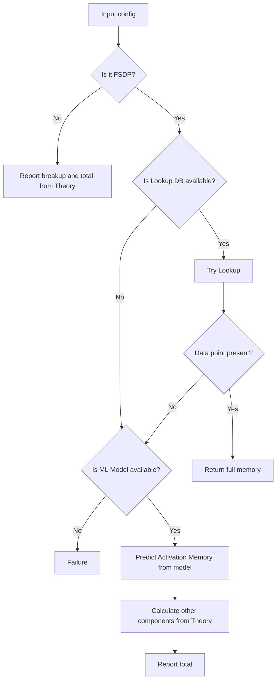

# Hybrid Memory Estimator

Uses a mix of theory, lookup and regressor, as follows.

```mermaid
flowchart TD
  A[Input config] --> B{Is it FSDP?};
  B -- No --> C[Report breakup and total from Theory];
  B -- Yes --> D{Is Lookup DB available?};
  D -- No --> H;
  D -- Yes --> E[Try Lookup];
  E --> F{Data point present?};
  F -- Yes --> G[Return full memory];
  F -- No --> H{Is ML Model available?};
  H -- No --> I[Failure];
  H -- Yes --> J[Predict Activation Memory from model];
  J --> K[Calculate other components from Theory];
  K --> L[Report total];
```
